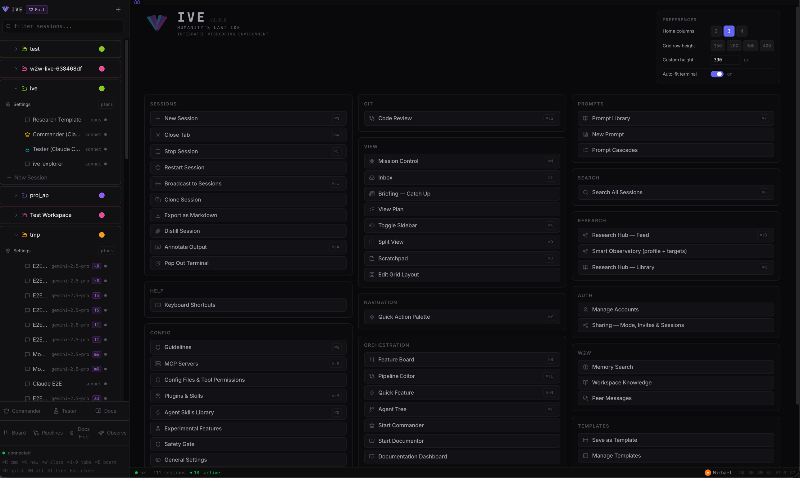
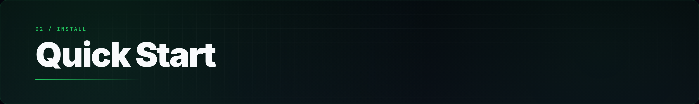
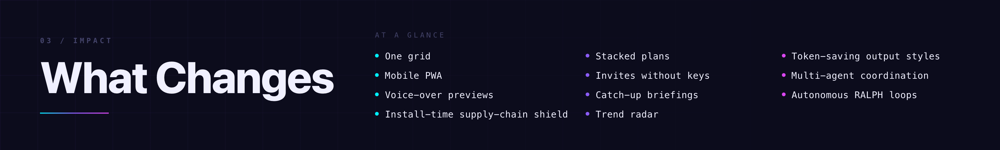
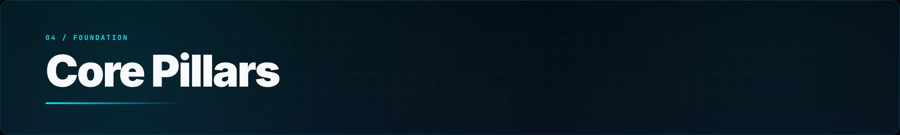
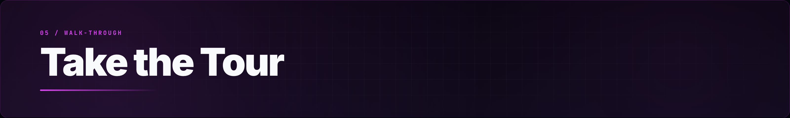
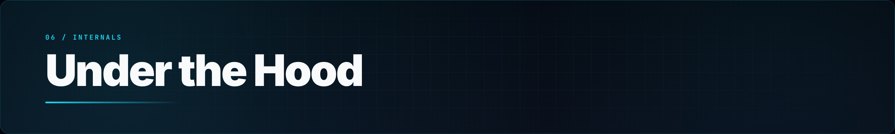
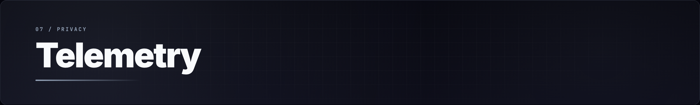
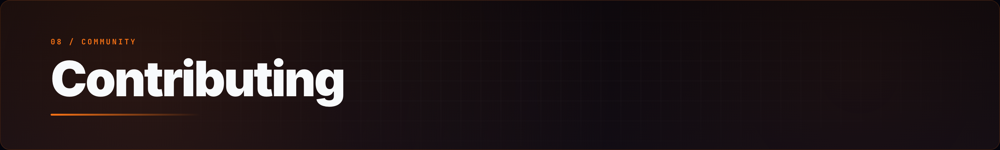

<br>

<p align="center">
  
</p>

<br>

<p align="center">
  <a href="https://github.com/michael-ra/ive/stargazers"></a>
  <a href="https://github.com/michael-ra/ive/blob/main/LICENSE"></a>
  
  
  
  
  
</p>

---


Six terminals open. Three Claude Code, two Gemini, one Commander session running workers. A friend jumps in from their phone to triage the Feature Board. A pipeline fires the moment a ticket lands in *In Progress*. Sonnet hits its quota mid-sentence and IVE rotates to your next account without dropping a keystroke. You go get coffee. Nothing stops.

If you've ever run more than one AI CLI at a time, you know the rest: lost context, four tabs open, "wait, which window had the auth fix?", and a quota you blew through twice over.

IVE puts every CLI session in one place — persistent, collaborative, and yours. One grid, every agent, no tab juggling.

<p align="center">
  <a href="https://ive.dev">
    
  </a>
</p>

---



```bash
git clone https://github.com/michael-ra/ive.git
cd ive
./start.sh
```

Open [http://localhost:5173](http://localhost:5173). That's it. IVE handles its own dependencies and CLI installations on first run.

> **Want to code from your phone or share with a friend?**
> Generate secure invites and toggle tunnels directly inside the app, or boot a public instance instantly with `npx ive --tunnel`.

---



**One grid, every session.** State, scroll, name, ownership — all tracked. The "which window had the auth fix" problem goes away.

**Stack your plans.** Claude Max, Gemini Ultra, raw API keys, whatever you've got. When a session hits `quota_exceeded`, IVE rotates to the next account and keeps going. The agent doesn't notice; the PR still ships.

**Code from your phone.** Add IVE to your home screen. It's a real PWA — push notifications, offline shell, full terminal. Your flow doesn't end when your laptop closes.

**Bring people in without sharing keys.** Hand a friend a 4-word invite. They land in your agent army with clamped access (Brief, Code, or Full). No screen sharing, no password reset, no key copying.

**Know what to build next.** The Observatory scans GitHub Trending, Hacker News, Product Hunt, and Reddit on a schedule and tells you what tools are worth integrating.

---




Use **Claude Code**, **Gemini CLI**, or whichever CLI ships next. IVE mounts real PTYs (`os.fork()` + `pty.openpty()`), so every native feature works exactly as the CLI intended — Shift+Tab, Plan Mode, slash commands, the lot. Swap models mid-session or switch CLIs in two keystrokes.


Hand a friend a 4-word passcode (or a QR for in-person). They land in your agent army with clamped access — Brief, Code, or Full — enforced at three layers (route guards, CLI flag injection, PreToolUse hooks). API keys stay on your machine: only the owner can read or change them.


Memory syncs through a central hub using three-way git merge (`git merge-file`). What one agent learns, every agent remembers. When you sit back down at your desk, a 2–5 sentence briefing waits at the top of the app — built from the event bus, git log, and memory diffs in a single LLM call.


Drag-and-drop node editor for autonomous workflows. Trigger pipelines from Kanban column moves, run TDD loops, or set up a RALPH cycle (Execute → Verify → Fix, up to 20 iterations) that just keeps going until tests pass. Built-in presets cover the common cases.


A built-in marketplace of 8,000+ skills, browsable offline (the catalog is baked in). Attach MCP servers — databases, web search, the bundled Deep Research engine, your internal tools — in one click. Plugin manifests translate between Claude and Gemini formats so you don't write the same thing twice.

---



A walk through what makes IVE different. Each section is a feature you can use today.

---

<a href="https://ive.dev/#orchestration"></a>

A meta-agent called *Commander* dispatches workers, assigns tickets, and watches progress. Visual *Pipelines* wire those workers into autonomous workflows. *RALPH Mode* iterates Execute → Verify → Fix until the tester passes. The *Feature Board* auto-dispatches tasks the moment they land in *In Progress* — Commander picks them up and gets started.

`Commander` · `Visual Pipelines` · `RALPH Loop` · `Auto-Dispatch Board`

---

<a href="https://ive.dev/#intelligence"></a>

A self-hosted *Deep Research* engine fans out across DuckDuckGo, arXiv, Semantic Scholar, and GitHub. None of those need API keys; Brave and SearXNG light up if you have them. The hub-and-spoke memory layer keeps every session aligned via three-way git merge. And the marketplace ships with 8,000+ skills you can browse offline.

`Deep Research` · `Shared Memory` · `8,000+ Skills` · `MCP Servers`

---

<a href="https://ive.dev/#collaboration"></a>

**Two agents, one repo, no chaos.** Before a destructive tool call, IVE compares each session's stated intent using local embeddings (BAAI/bge-small-en-v1.5, no API keys). Cosine ≥ 0.80 blocks the conflict; 0.65–0.80 lets it through but shares lessons learned. A central event bus pipes every tool call, every commit, every pipeline transition through a single audit trail.

`Intent Coordination` · `Event Bus` · `Local Embeddings` · `Full Audit Trail`

---

<a href="https://ive.dev/#multiplayer"></a>

**Hand a friend a 4-word invite.** They land in your agent army clamped to *Brief* (read + comment), *Code* (drive sessions, shell off unless you allowlist commands), or *Full* (TTL-bounded owner-equivalent). Three layers enforce the clamp: route guards, CLI flag injection, and PreToolUse hooks. API keys stay on your machine — only the owner can read or change them.

`4-Word Invites` · `QR + PWA` · `Brief · Code · Full` · `Zero Key-Sharing`

---

<a href="https://ive.dev/#catchup"></a>

**Step away for an hour. Or a week.** Come back to a 2–5 sentence briefing covering what your agents shipped, what your team committed, and what your memory hub learned. It's built from the event bus, per-workspace git log, and memory diffs in a single Haiku/Sonnet call. The stale-session banner pops up automatically when you've been gone more than 30 minutes.

`Prose Briefings` · `Activity Feed` · `Stale-Session Banner` · `Mode-Aware`

---

<a href="https://ive.dev/#workflows"></a>

**Your prompts become reusable.** Save templates and reference them inline with `@prompt:Name` tokens. Chain them into *cascades* with variables, loops, and auto-approval. Dial output verbosity per session with output styles (lite, caveman, ultra, dense). The same prompt that fixed a bug last Tuesday is one keystroke away today.

`Prompt Library` · `Cascades` · `Loop Support` · `Output Styles`

---

<a href="https://ive.dev/#sessions"></a>

**Twenty terminals, zero panic.** Saveable grid layouts. Session merging when two threads converged. Broadcast keystrokes to a group. A multi-line composer with markdown structure for when you need to send more than `yes`. Tabs stay mounted when you switch — no scroll loss, no state reset, no replay-from-zero.

`Grid Layouts` · `Session Merge` · `Broadcast Groups` · `Composer`

---

<a href="https://ive.dev/#devtools"></a>

**Code review built in.** Inline git-diff annotations. Live previews of your dev server, with voice notes you can record over the screenshot. AI code review on demand. 35+ keyboard shortcuts (configurable) so your hands stay on the keys.

`Diff Annotations` · `Voice Notes` · `Live Previews` · `Configurable Shortcuts`

---

<a href="https://ive.dev/#security"></a>

**Defense at every layer, not bolted on.** *Anti-Vibe-Code-Pwner* (AVCP) scans every package install — pip, npm, yarn — for supply-chain attacks before the agent executes it. Sessions can run inside isolated git worktrees so experiments stay off your main checkout. Auth uses constant-time token comparison (`hmac.compare_digest`), HttpOnly + `SameSite=Strict` cookies, and a strict CSP. Joiner sessions are clamped at three independent layers (route guards, CLI flag injection, PreToolUse hooks) — so a single missed check isn't fatal.

`AVCP Scanner` · `Isolated Worktrees` · `Constant-Time Auth` · `Defense-in-Depth`

---



* **Backend**: Python (`aiohttp`) spawning real PTY sessions via `os.fork()`. Handles 140+ REST routes and a single multiplexed WebSocket for realtime control.
* **Frontend**: React 19 + Vite 8 + xterm.js. Zustand for state management, styled with Tailwind CSS v4.
* **Data**: Local SQLite (`~/.ive/data.db`). **Zero external cloud dependencies.**
* **Security**: Constant-time token comparisons, HttpOnly + SameSite cookies, strict CSP, and built-in Anti-Vibe-Code-Pwner supply chain scanning.

---



During Alpha, IVE sends anonymous usage pings (PostHog) so we can see how many installs are active and which versions people run. **Enabled by default.** What's actually sent: a hashed machine ID, version string, platform tag, session count, and uptime. **No PII, no code, no prompts, no project paths.** The full payload is hardcoded in [`backend/telemetry.py`](backend/telemetry.py) — read it before you decide.

To opt out:
```bash
IVE_TELEMETRY=off ./start.sh
```

---



IVE is open source and early. Bug reports, new CLI profiles, docs improvements, weird edge cases — all welcome. See [CONTRIBUTING.md](CONTRIBUTING.md).

<p align="center">
  Built by the IVE community.
</p>
