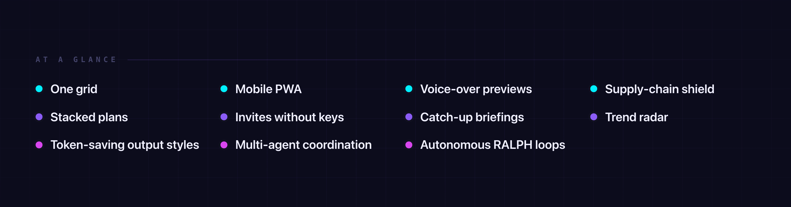

<br>

<p align="center">
  
</p>

<br>

<p align="center">
  <a href="https://github.com/michael-ra/ive/stargazers"></a>
  <a href="https://github.com/michael-ra/ive/blob/main/LICENSE"></a>
  
  
  
  
  
</p>

---


IVE is a local browser workspace for running many AI coding CLIs in parallel — Claude Code, Gemini CLI, and whichever ships next. Real persistent PTYs, auto-rotation across accounts when you hit a quota, shared memory between agents, auto-distilled learnings from every session, mobile PWA, 900+ skills and plugins to extend it, supply-chain attacks blocked on autopilot, and collaboration with friends without the git-merge hell. Want a custom code workflow? Meet pipelines — drag-and-drop autonomous agent graphs that just run. Never worry about managing workflows again.

If you've ever run more than one AI CLI at a time, you know the rest: lost context, four tabs open, "wait, which window had the auth fix?", and a quota you blew through twice over.

IVE puts every CLI session in one place — persistent, collaborative, and yours. One grid, every agent, no tab juggling.

Stop managing tabs. Stop worrying about missing new trends in AI coding. Stop worrying about context sharing. Start collaborating. Ship fast. And build your solution in lightspeed. This is IVE.

<p align="center">
  <a href="https://ive.dev">
    
  </a>
</p>

---


```bash
git clone https://github.com/michael-ra/ive.git
cd ive
./start.sh
```

Open [http://localhost:5173](http://localhost:5173). That's it. IVE handles its own dependencies and CLI installations on first run.

> **Want to code from your phone or share with a friend?**
> Generate secure invites and flip the tunnel on right inside the app — no extra commands, no separate accounts.

---




- **One grid, every session.** State, scroll, name, ownership — all tracked. The "which window had the auth fix" problem goes away.
- **Stack your plans.** Claude Max, Gemini Ultra, raw API keys, whatever you've got. When a session hits `quota_exceeded`, IVE rotates to the next account and keeps going. The agent doesn't notice; the PR still ships.
- **Strip the agent chatter.** Output styles — caveman, dense, lite, ultra — collapse "Sure! Here's what I did and why…" into just the answer. Same content, fraction of the tokens. Set globally, per workspace, or per session.
- **Code from your phone.** Add IVE to your home screen. Real PWA — full terminal, push notifications when something needs you (over the public tunnel or any HTTPS URL — browsers block push on plain LAN HTTP), and your app icon on the home screen instead of a browser tab. Your flow doesn't end when your laptop closes.
- **Bring people in without sharing keys.** Hand a friend a 4-word invite. They land in your agent army with clamped access (Brief, Code, or Full). No screen sharing, no password reset, no key copying.
- **Multi-agent without the merge chaos.** Two sessions about to touch the same file? IVE notices before they stomp each other — blocking the high-overlap collisions and just sharing notes on the lower ones. Memory syncs through a hub so what one agent learns, every agent remembers.
- **Talk to it like a designer.** Hold ⌘R over the Live Preview and narrate what you want changed. IVE records the screen, your voice, and a transcript, then drops the lot into the session. The agent gets the clip *and* what you said — no typing the feedback out.
- **Step away. Come back to a paragraph.** When you've been gone a while, a banner shows up with a 2–5 sentence briefing of what your agents shipped, what your team committed, and what memory picked up. One hour, one week, one month — same flow.
- **Loops that don't quit.** RALPH runs execute → verify → fix until the tester passes — up to 20 iterations. You start it once, you go to bed, you come back to a green build.
- **One safety net under every install.** Anti-Vibe-Code-Pwner checks every `npm install` and `pip install` an agent tries — typo-squats, sketchy post-install scripts, brand-new uploader accounts — *before* the install runs. So you can leave agents unsupervised without leaving your machine unsupervised.
- **Know what to build next.** The Observatory scans GitHub Trending, Hacker News, and Product Hunt on a schedule (with Reddit and other sources you can wire up in Smart mode) and tells you what tools are worth integrating.

---


Use **Claude Code**, **Gemini CLI**, or whichever CLI ships next. Every session is a real terminal, so every native feature works exactly as the CLI intended — Shift+Tab, Plan Mode, slash commands, the lot. Swap models mid-session or switch CLIs in two keystrokes.


Hand a friend a 4-word passcode (or a QR for in-person). They land in your agent army with clamped access — Brief, Code, or Full. API keys stay on your machine: only the owner can read or change them.


Memory syncs through a central hub. What one agent learns, every agent remembers — without one session stomping another's notes. When you come back to your desk, a 2–5 sentence briefing waits at the top of the app, summarizing what shipped while you were gone.


Drag-and-drop node editor for autonomous workflows. Trigger pipelines from Kanban column moves, run TDD loops, or set up a RALPH cycle (Execute → Verify → Fix, up to 20 iterations) that just keeps going until tests pass. Built-in presets cover the common cases.


A built-in marketplace with 8,000+ skills, browsable offline. Attach MCP servers — databases, web search, the bundled Deep Research engine, your internal tools — in one click. Plugins written for Claude work in Gemini and vice versa, without you writing the same thing twice.

---


A walk through what makes IVE different. Each section is a feature you can use today.

---

<a href="https://ive.dev/#orchestration"></a>

A meta-agent called *Commander* dispatches workers, assigns tickets, and watches progress. Visual *Pipelines* wire those workers into autonomous workflows. *RALPH Mode* iterates Execute → Verify → Fix until the tester passes. The *Feature Board* auto-dispatches tasks the moment they land in *In Progress* — Commander picks them up and gets started.

`Commander` · `Visual Pipelines` · `RALPH Loop` · `Auto-Dispatch Board`

---

<a href="https://ive.dev/#intelligence"></a>

A self-hosted *Deep Research* engine fans out across DuckDuckGo, arXiv, Semantic Scholar, and GitHub. None of those need API keys; Brave and SearXNG light up if you have them. The hub-and-spoke memory layer keeps every session aligned via three-way git merge. And the marketplace ships with 8,000+ skills you can browse offline.

`Deep Research` · `Shared Memory` · `8,000+ Skills` · `MCP Servers`

---

<a href="https://ive.dev/#collaboration"></a>

**Two agents, one repo, no chaos.** Before two sessions stomp each other, IVE notices they're working on the same thing and steps in — blocking the collision when the overlap is high, or just sharing what the other one already learned when it's lower. Every tool call, every commit, every pipeline step also lands in a single audit trail you can scroll back through.

`Intent Coordination` · `Event Bus` · `Audit Trail` · `Conflict Detection`

---

<a href="https://ive.dev/#multiplayer"></a>

**Hand a friend a 4-word invite.** They land in your agent army with the access level you pick: *Brief* (read and comment), *Code* (drive sessions, no shell unless you say so), or *Full* (a time-limited stand-in for you). API keys stay on your machine — only the owner can read or change them.

`4-Word Invites` · `QR + PWA` · `Brief · Code · Full` · `Zero Key-Sharing`

---

<a href="https://ive.dev/#catchup"></a>

**Step away for an hour. Or a week.** Come back to a 2–5 sentence briefing of what your agents shipped, what your team committed, and what your memory hub picked up. A banner shows up automatically once you've been gone long enough to need one.

`Prose Briefings` · `Activity Feed` · `Stale-Session Banner` · `Mode-Aware`

---

<a href="https://ive.dev/#workflows"></a>

**Your prompts become reusable.** Save templates and drop them inline with `@prompt:Name`. Chain them into *cascades* with variables, loops, and auto-approval. Dial output verbosity per session. The prompt that fixed a bug last Tuesday is one keystroke away today.

`Prompt Library` · `Cascades` · `Loop Support` · `Output Styles`

---

<a href="https://ive.dev/#sessions"></a>

**Twenty terminals, zero panic.** Saveable grid layouts. Session merging when two threads converged. Broadcast keystrokes to a group. A multi-line composer with markdown structure for when you need to send more than `yes`. Tabs stay mounted when you switch — no scroll loss, no state reset, no replay-from-zero.

`Grid Layouts` · `Session Merge` · `Broadcast Groups` · `Composer`

---

<a href="https://ive.dev/#devtools"></a>

**Code review built in.** Inline git-diff annotations. Live previews of your dev server, with voice notes you can record over the screenshot. AI code review on demand. 35+ keyboard shortcuts (configurable) so your hands stay on the keys.

`Diff Annotations` · `Voice Notes` · `Live Previews` · `Configurable Shortcuts`

---

<a href="https://ive.dev/#security"></a>

**Built so you can run agents unattended.** *Anti-Vibe-Code-Pwner* checks every package install for supply-chain attacks before the agent runs it. Sessions can live in isolated git worktrees, so experiments never touch your main checkout. When you invite a friend, their access is genuinely clamped — they can't escape Brief or Code mode by knowing the right URL.

`AVCP Scanner` · `Isolated Worktrees` · `Constant-Time Auth` · `Defense-in-Depth`

---


* **Backend**: Python (`aiohttp`) spawning real PTY sessions via `os.fork()`. 300+ REST routes and a single multiplexed WebSocket for realtime control.
* **Frontend**: React 19 + Vite 8 + xterm.js. Zustand for state management, styled with Tailwind CSS v4.
* **Data**: Local SQLite at `~/.ive/data.db`. Your sessions, memory, prompts, and API keys never leave the machine. The only outbound calls IVE makes by default are anonymous version pings (opt-out, see Telemetry below) and the public research feeds the Observatory checks; tunnel mode adds Cloudflare while it's active.
* **Security**: Constant-time token comparisons, HttpOnly + SameSite cookies, strict CSP, and built-in Anti-Vibe-Code-Pwner supply chain scanning.

---


During Alpha, IVE sends anonymous pings so we can see how many installs are active and which version they're on. **Enabled by default.** No code, no prompts, no project names — we don't want it and we don't store it. If you'd rather verify than trust, the entire payload is in [`backend/telemetry.py`](backend/telemetry.py).

To opt out:
```bash
IVE_TELEMETRY=off ./start.sh
```

---


IVE is open source and early. Bug reports, new CLI profiles, docs improvements, weird edge cases — all welcome. See [CONTRIBUTING.md](CONTRIBUTING.md).

---

> **Experimental alpha release.** Things move fast and will occasionally break — schema, APIs, and UI are still in flux. Pin a commit if you need stability, and expect rough edges. Feedback welcome.

<p align="center">
  Built by the IVE community.<br>
  Made with ❤️ in Berlin.
</p>

