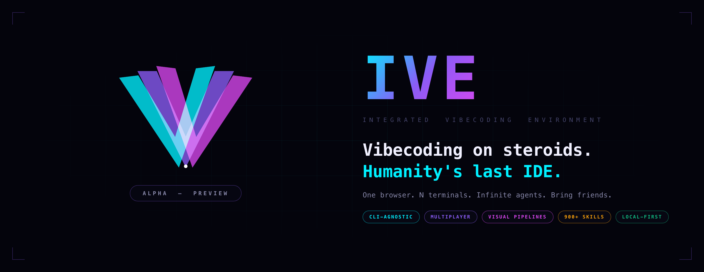
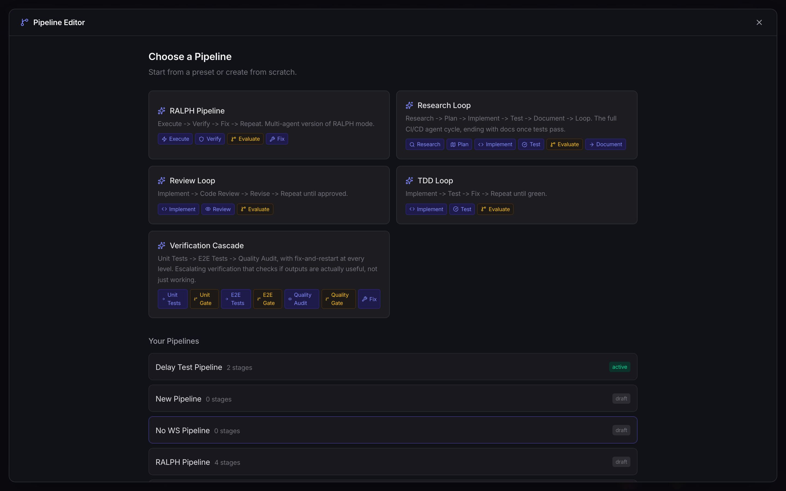

<br>
<p align="center">
  <picture>
    <source media="(prefers-color-scheme: dark)" srcset="docs/screenshots/landing/hero.png">
    <source media="(prefers-color-scheme: light)" srcset="docs/screenshots/landing/hero.png">
    
  </picture>
</p>
<br>

<h1 align="center">IVE — The AI Agent Workspace</h1>

<p align="center">
  <a href="https://ive.dev">Website</a> ·
  <a href="https://ive.dev/docs">Docs</a> ·
  <a href="https://github.com/michael-ra/ive/stargazers">GitHub Stars</a>
</p>

> **🌤️ Want a public URL?** Toggle the tunnel in the UI, or boot with `./start.sh --tunnel`.

---

### 🤖 LLM Quickstart
Direct your favorite coding agent (Claude Code, Cursor, etc) to `CLAUDE.md`.
Prompt away!

### 👋 Human Quickstart
**1. Clone the repository and run the setup script:**
```bash
git clone https://github.com/michael-ra/ive.git
cd ive
./start.sh
```

**2. [Optional] Want to collaborate or code from your phone?**
Generate secure invites and toggle the tunnel directly inside the app, or boot with a public tunnel instantly:
```bash
./start.sh --tunnel
```

**3. Open your browser:**
Navigate to [http://localhost:5173](http://localhost:5173) and start commanding agents.

---

### ⚡ The Pitch

Six terminals open. Three Claude Code, two Gemini, one Commander session running workers. A friend jumps in from their phone to triage the Feature Board. A pipeline fires the moment a ticket lands in *In Progress*. Sonnet hits its quota mid-sentence and IVE rotates to your next account without dropping a keystroke. You go get coffee. **Nothing stops.**

If you've ever run more than one AI CLI at a time, you know the rest: lost context, four tabs open, *"wait, which window had the auth fix?"*, and a quota you blew through twice over.

**IVE puts every CLI session in one place — persistent, collaborative, and yours. One grid, every agent, no tab juggling.**

---

### 🥊 Standard CLIs vs IVE

**Use a Standard Terminal AI**
- You only need to run one agent at a time
- You don't need persistent context or memory between sessions
- You prefer to manually copy-paste code for collaboration

**Use the IVE Agent Workspace (recommended)**
- **One grid, every session** — State, scroll, name, ownership all tracked.
- **Stack your plans** — Rotate Claude Max, Gemini Ultra, and API keys automatically on `quota_exceeded`.
- **Code from your phone** — Real PWA with push notifications and full terminal access.
- **Multiplayer without key sharing** — Hand a friend a 4-word invite for clamped access.
- **No merge chaos** — IVE blocks high-overlap file collisions between agents.
- **Talk to it like a designer** — Hold `⌘R` over Live Preview to narrate UI feedback.
- **Catch-up briefings** — Get 2–5 sentence summaries of what agents shipped while you were gone.
- **Loops that don't quit** — RALPH runs execute → verify → fix up to 20 iterations.
- **One safety net** — Anti-Vibe-Code-Pwner checks every `npm install` for typo-squats.
- **Know what to build next** — The Observatory scans GitHub Trending & HN on a schedule.

---

### 📋 Demos

📋 **Visual Pipelines**
Task = "Run a multi-agent execute → verify → fix loop."

[Pipeline Docs ↗](https://ive.dev/docs/features/pipelines)

🤝 **Multiplayer & Memory**
Task = "Code from my phone while my teammate works on the laptop."

[Memory Docs ↗](https://ive.dev/docs/api/memory)

🔍 **Integrated Code Review**
Task = "Review diffs and send feedback directly to the agent."

[Code Review Docs ↗](https://ive.dev/docs/guide/code-review)

💡See more examples here ↗ and give us a star!

---

### 🚀 Extensibility Quickstart

Want to give your agents more power? IVE ships with a built-in marketplace of **over 9000 skills**, daily more skills and updated. Just pull the repo for now (Network update coming soon). 

Easily attach Model Context Protocol (MCP) servers:
- **Commander** — orchestrates worker sessions
- **Tester** — verifies work via structured pass/fail reporting
- **Documentor** — auto-builds a docs site for your project
- **Deep Research** — bundled engine for multi-backend search

Manage it all with the `⌘K` command palette or the dedicated MCP/Skills panels.

---

### 💻 CLI Integration

IVE wraps your existing CLIs seamlessly. It mounts real PTY terminals, meaning all native features work perfectly inside the browser UI:

```bash
Shift + Tab        # Context switching
/plan              # Native plan modes
@prompt:           # Inline prompt expansion
@ralph             # Trigger the Execute -> Verify -> Fix loop
```
The backend keeps the PTY running between sessions for fast iteration. 

---

### 🤖 Claude Code & Gemini Integration

IVE natively supports Claude Code and Gemini CLI. To get the most out of IVE, ensure your agents are aware of the workspace conventions:

```bash
# IVE automatically handles workspace context via its memory hub.
# It injects relevant knowledge directly into the PTY session.
```

Integrations, hosting, custom tools, MCP, pipelines, and more on our [Docs ↗](https://ive.dev/docs)

---

### ❓ FAQ

**Is it secure?**
Yes. Local SQLite (`~/.ive/data.db`). Zero external cloud dependencies. API account sandboxing, constant-time token comparisons, and built-in supply chain scanning.

**What about telemetry?**
IVE ships with anonymous, local-first telemetry **enabled by default** (version, platform, session count). **No PII, no code, no prompts are ever collected.**
To opt out:
```bash
IVE_TELEMETRY=off ./start.sh
```

**How do I contribute?**
Check out [CONTRIBUTING.md](CONTRIBUTING.md) to get started!

---


---

<p align="center">
  Built out of frustration about current coding tools. By IVE community, for everyone.<br>
</p>
